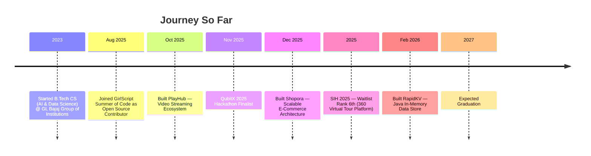

<div align="center">

<!-- Animated Banner -->


<!-- Animated Typing Header -->
<a href="https://git.io/typing-svg">
  
</a>

<br/>

<!-- Social Badges -->
<p>
  <a href="<YOUR_LINKEDIN_URL>">
    
  </a>
  <a href="https://github.com/<YOUR_GITHUB_USERNAME>">
    
  </a>
  <a href="https://leetcode.com/<YOUR_LEETCODE_USERNAME>">
    
  </a>
  <a href="mailto:rahul.sharma2023@glbajajgroup.org">
    
  </a>
</p>

<!-- Profile Views & Visitor Counter -->
&label=Profile%20Views&color=9333EA&style=for-the-badge" alt="Profile Views"/>
.<YOUR_GITHUB_USERNAME>&style=for-the-badge&color=C026D3" alt="Visitor Badge"/>

<!-- Followers / Stars -->
?label=Followers&style=for-the-badge&color=6D28D9&logo=github"/>
?label=Stars&style=for-the-badge&color=9333EA&logo=github"/>

</div>

<!-- Section Separator -->


## 🧑‍💻 About Me


- 🚀 Performance-driven **Software Developer** specializing in scalable backend systems and AI-integrated applications
- 🧠 Strong foundation in **Data Structures & Algorithms** — **500+ problems** solved on LeetCode
- 🤖 Highly proficient in **AI-assisted development**, exploring cloud architecture and agentic workflows
- 🌱 Active open-source contributor via **GirlScript Summer of Code (GSSoC)**
- 🏗️ Builder of production-grade real-time systems (MERN, Java sockets, in-memory data stores)
- 🎓 B.Tech in Computer Science (AI & Data Science) @ GL Bajaj Group of Institutions (AKTU), 2023–2027
- 🏆 SIH 2025 Waitlist Rank 6th · QubitX 2025 Hackathon Finalist
- 📫 Reach me at **rahul.sharma2023@glbajajgroup.org**

<br clear="right"/>


## ⚡ Tech Stack

<div align="center">

### Languages


### Frontend


### Backend


### Databases & Caching


### Cloud & DevOps


### AI Tools


### Core CS & Concepts


</div>

<!-- Animated Skill Icons -->
<div align="center">
  
</div>


## 📊 GitHub Analytics

<div align="center">
  &show_icons=true&theme=radical&hide_border=true&bg_color=0D1117&title_color=A855F7&icon_color=C026D3&text_color=E6EDF3&count_private=true"/>
  &layout=compact&theme=radical&hide_border=true&bg_color=0D1117&title_color=A855F7&text_color=E6EDF3"/>
</div>

<div align="center">
  &theme=radical&hide_border=true&background=0D1117&stroke=A855F7&ring=C026D3&fire=C026D3&currStreakLabel=E6EDF3"/>
</div>

<div align="center">
  &theme=redical&hide_border=true&bg_color=0D1117&color=A855F7&line=C026D3&point=E6EDF3&area=true&area_color=9333EA"/>
</div>

### 🐍 Contribution Snake

<div align="center">
  /<YOUR_GITHUB_USERNAME>/output/github-contribution-grid-snake-dark.svg" alt="snake animation"/>
</div>

> Generated automatically by the `.github/workflows/snake.yml` action below — see **Setup Instructions**.

### 🌍 3D Contribution Calendar

<div align="center">
  /<YOUR_GITHUB_USERNAME>/main/profile-3d-contrib/profile-night-rainbow.svg" alt="3D contribution calendar"/>
</div>

> Generated via the [`profile3D`](https://github.com/yoshi389111/github-profile-3d-contrib) action — see workflow file `profile-3d.yml`.

### 🏆 Trophies

<div align="center">
  &theme=radical&no-frame=true&no-bg=true&margin-w=15&row=1&column=7"/>
</div>


## 🧩 Competitive Programming & Coding Platforms

<div align="center">

<!-- LeetCode Card -->
?theme=dark&font=Fira%20Code&ext=heatmap" alt="LeetCode Stats"/>

<br/>

| Platform | Profile | Highlight |
|:--:|:--:|:--:|
|  | [`<YOUR_LEETCODE_USERNAME>`](https://leetcode.com/<YOUR_LEETCODE_USERNAME>) | 500+ Problems Solved |
|  | [`<YOUR_GITHUB_USERNAME>`](https://github.com/<YOUR_GITHUB_USERNAME>) | Open Source + Projects |
|  | [`Rahul Sharma`](<YOUR_LINKEDIN_URL>) | Professional Network |

</div>


## ⏱️ Coding Activity (WakaTime)

<!--START_SECTION:waka-->
```text
From <YOUR_WAKATIME_USERNAME>'s WakaTime stats — updates automatically via
.github/workflows/waka-readme.yml (see Setup Instructions below).

Java         ████████████░░░░░░░░░░░░   XX hrs XX mins
JavaScript   ██████████░░░░░░░░░░░░░░   XX hrs XX mins
TypeScript   ██████░░░░░░░░░░░░░░░░░░   XX hrs XX mins
Markdown     ████░░░░░░░░░░░░░░░░░░░░   XX hrs XX mins
```
<!--END_SECTION:waka-->


## 🗂️ Featured Projects

<table>
<tr>
<td width="50%" valign="top">

### 🛍️ Shopora
**Scalable E-Commerce Architecture**
`Dec 2025 – Jan 2026`

Marketplace with RBAC, secure session management, and real-time order sync via Socket.io. Modular REST API built on an MVC backend pattern with optimized DB constraints for low-latency data flow.

**Stack:** `MERN` `Socket.io` `Express Middleware` `MongoDB Atlas`

[](<YOUR_SHOPORA_LIVE_URL>)
[](<YOUR_SHOPORA_REPO_URL>)

</td>
<td width="50%" valign="top">

### ⚡ RapidKV
**High-Performance In-Memory Data Store**
`Feb 2026 – Mar 2026`

Redis-equivalent data store built from scratch in Java — HashMap + Skip List indexing, AOF persistence with command replay, multi-client server via Java sockets, and a custom TTL expiration engine.

**Stack:** `Java` `Redis Internals` `Sockets` `Multi-threading`

[](<YOUR_RAPIDKV_REPO_URL>)

</td>
</tr>
<tr>
<td width="50%" valign="top">

### 🎬 PlayHub
**Video Streaming & Content Ecosystem**
`Oct 2025 – Nov 2025`

Video engine with async uploads, high-concurrency playlist delivery, and a Creator Analytics Dashboard built on MongoDB aggregation pipelines. AI-driven search cut redundant server requests by 40%. Secure sessions via JWT + HTTP-only cookies.

**Stack:** `React` `Node.js` `MongoDB` `Cloudinary` `JWT` `Redux Toolkit` `AWS`

[](<YOUR_PLAYHUB_LIVE_URL>)
[](<YOUR_PLAYHUB_REPO_URL>)

</td>
<td width="50%" valign="top">

### 🌐 Open Source — GSSoC
**GirlScript Summer of Code**
`Aug 2025 – Oct 2025`

Contributed to multiple repositories focused on REST API optimization and server-side bottlenecks. Refactored legacy codebases to modern ES6+ standards and collaborated with maintainers on UI modularity and security hardening.

[](<YOUR_GSSOC_PROFILE_URL>)

</td>
</tr>
</table>


## 🧭 Timeline




## 💼 Experience & Education

<table>
<tr>
<td valign="top" width="50%">

### 🏢 Experience

**Open Source Contributor**
*GirlScript Summer of Code (GSSoC)*
`Aug 2025 – Oct 2025`
- REST API optimization & bottleneck fixes
- Legacy → modern ES6+ refactors
- Code review collaboration with maintainers

</td>
<td valign="top" width="50%">

### 🎓 Education

**B.Tech, Computer Science (AI & Data Science)**
*GL Bajaj Group of Institutions, Mathura (AKTU)*
`2023 – 2027`
- Current CGPA: **7.1**
- Core focus: DSA, OOP, DBMS, CN, System Design

</td>
</tr>
</table>

### 🏅 Achievements

<div align="center">

| 🏆 Achievement | Details |
|:--|:--|
| **DSA Proficiency** | 500+ problems solved on LeetCode |
| **Smart India Hackathon (SIH) 2025** | Waitlist Rank 6th — 360° virtual tour platform |
| **QubitX 2025** | Hackathon Finalist among national competing teams |

</div>


## 💬 Random Dev Quote

<div align="center">
  
</div>


## 📇 Contact

<div align="center">
<table>
<tr>
<td align="center" width="25%">
<a href="<YOUR_LINKEDIN_URL>"><br/><b>LinkedIn</b></a>
</td>
<td align="center" width="25%">
<a href="https://github.com/<YOUR_GITHUB_USERNAME>"><br/><b>GitHub</b></a>
</td>
<td align="center" width="25%">
<a href="https://leetcode.com/<YOUR_LEETCODE_USERNAME>"><br/><b>LeetCode</b></a>
</td>
<td align="center" width="25%">
<a href="mailto:rahul.sharma2023@glbajajgroup.org"><br/><b>Email</b></a>
</td>
</tr>
</table>
</div>


<div align="center">
  <i>Thanks for stopping by — let's build something great together 🚀</i>
</div>
